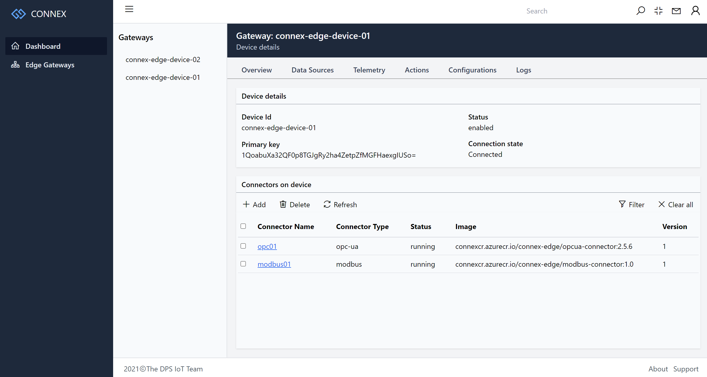

# **CONNEX**: An Integrated IIoT edge to cloud solution with multi-protocol support
Built on Azure IoT services with its SDKs, this PoC repo demostrate how to develop an integrated edge to cloud solution with multiple industrial protocol support and centralized management capabilities by leveraging the cloud-native technologies to get industrial data in and process it in the edge or cloud side.

## Solution architecture
The whole solution is consits of edge and cloud applications. 

Multiple industrial protocol connectors is running as containers on top of Azure IoT Edge runtime in edge side, they will collect datas from various field devices and sent it to cloud.

Cloud side includes all Azure Services and the management portal application. The management portal deploy, configure, and monitor all workloads in the edge devices to control what data can be ingest to cloud for further proces. Details see below architecture diagram:  

## Features now available:  

### 1. Multiple industrial protocols support
* OPC DA/UA, 
* Modbus,
* Ethernet/IP  

it can be extended to support more protocols by building your protocol connector container and use it in Connex. 

### 2. Centralized management portal
We build a centralized web portal by using the Spring boot, Vue and with the Azure IoT Hub Service SDKs integrated for managing and configuring the connectors running on Azure IoT Edge devices, without the need to do it in Azure portal.
* Deploy industrial protocol connectors directly
* Add data source and its data points to collect data from various field devices
* Basic charts for telemetry visualization
* Flexiable deployment for both in local or cloud.

### 3. Azure IoT Hub capabilities integration
From technical pespective, we demonstrate how the capabilities of Azure IoT Hub can be integrated into your own application by using the Azure IoT Hub service SDKs to implement below task in your application:
* Deploy Azure IoT Edge module to edge device
* Get and list the device and module details
* Update device twins, and module twins for edge devices
* Invoke direct methods of the Azure IoT Edge modules to take action
* Using module twins for edge module configuration 
* Receive data from Azure IoT Hub built-in endpoints
* Visualize data in browser end by using websocket natively.

You can use this repo as code base to get start, and **accelerate** the Azure-based IoT solution development and adoption.

### 4. Build from industiral domain perspective 
We try to build the whole solution based on the domain knowledges that the OT guys familar with, without too much IT terms embbeded.

Feel free to clone and contribute.

## License
MIT

